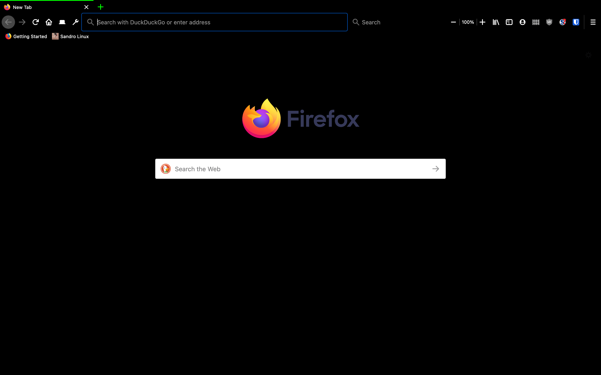

# Sandro-Linux-Matrix-Theme
A theme which gives Firefox a Black and Lime look
<h2>Screenshots</h2>

<h2>Screenshots</h2>

Screenshot of a normal firefox installation with my theme

Screenshot of a firefox installation using the Photon Australis Dark with my theme

